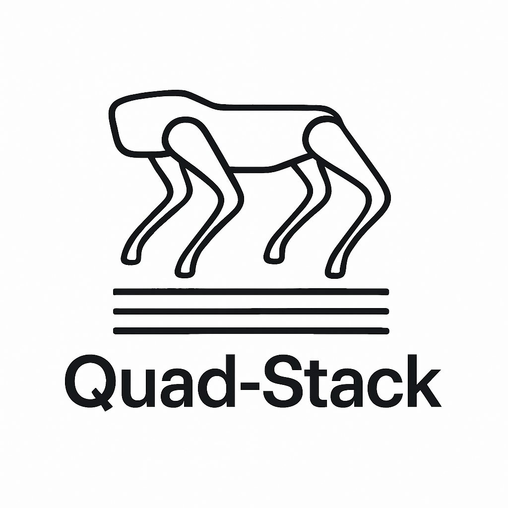

<p align="center">
  
</p>

<h1 align="center">QuadStack</h1>

<p align="center">
  Software stack for MAB and Unitree quadrupeds, powering robust localization, mapping and navigation:
</p>

<p align="center">
  <a href="#"></a>
  <a href="#"></a>
  <a href="#"></a>
  <a href="#"></a>
</p>

---

## Features

- **Neural locomotion**  
- **Visual Inertial Kinematic aided odometry**  
- **Velocity Constrained SLAM**  
- **Navigation, Planning & Exploration**  


## Install & Setup
To clone

```bash
git clone https://github.com/dyumanaditya/quad-stack --recursive
```

To install all the necessary dependencies run the following

```bash
chmod +x setup.sh
./setup.sh
```


## Robots

This repository supports the 
- MAB Silver Badger (`silver_badger`)
- MAB Honey Badger (`honey_badger`)
- Unitree A1 (`a1`)
- Unitree Go1 (`go1`)
- Unitree Go2 (`go2`)

<div style="display: flex; justify-content: space-between;">
    
    
    
    
    
</div>


To bringup a particular robot add the argument

```bash
robot:=<name>
```

## Worlds
By default there are two main worlds:

- AWS Small Warehouse
- AWS Small House

You can add more worlds by putting them inside the [`quadstack_gazebo/worlds`](quad_stack/quadstack_gazebo/worlds/) folder. To launch the simulation with the AWS worlds, follow the next steps

### Export the model Path
**AWS Warehouse**
```bash
export GAZEBO_MODEL_PATH=/home/ws/src/quad-stack/quad_stack/quadstack_gazebo/worlds/aws-robomaker-small-warehouse-world/models
```

**AWS House**
```bash
export GAZEBO_MODEL_PATH=/home/ws/src/quad-stack/quad_stack/quadstack_gazebo/worlds/aws-robomaker-small-house-world/models
```

### Add the world argument on bringup
**AWS Warehouse**
```bash
world:=aws-robomaker-small-warehouse-world/worlds/no_roof_small_warehouse.world
```

**AWS House**
```bash
world:=aws-robomaker-small-house-world/worlds/small_house.world
```

Custom worlds can be used similarly.


## Neural Teleoperation


## Visual Odometry


## SLAM


## Navigation


## Autonomous Exploration


## Usage

Here are the commands to run the package. The following launch arguments are supported

- `robot` (silver_badger, honey_badger, a1, go1, go2)
- `world` (the name of any world file in the [gazebo worlds folder](./quad_stack/quadstack_gazebo/worlds/))
- `x_pose`, `y_pose`, `z_pose`
- `map` (absolute path of a map yaml file) if you are running navigation and want to use a pre-made map

## Using Gazebo World Packages
If you are using a gazebo world that has a separate directory for models, you will need to run the following before launching

```bash
export GAZEBO_MODEL_PATH=<path-to-model-folder>
```


### Spawning the robot

```bash
ros2 launch quadstack_bringup spawn_robot.launch.py world:=empty_world.world robot:=a1
```

### Teleoperating the robot

```bash
ros2 launch quadstack_bringup teleop.launch.py world:=empty_world.world robot:=a1
```

### Visual and Legged Odometry

```bash
ros2 launch quadstack_bringup odometry.launch.py robot:=silver_badger
```

### Navigation Stack
**Note:** Replace the map path by your absolute path, this is just an example
```bash
ros2 launch quadstack_bringup navigation.launch.py map:=/home/ws/src/quad-stack/quad_stack/quadstack_localization/maps/turtlebot_map.yaml robot:=a1
```

## Bibtex
If you use this in your work please cite

```bibtex
@misc{aditya2025robustlocalizationmappingnavigation,
      title={Robust Localization, Mapping, and Navigation for Quadruped Robots}, 
      author={Dyuman Aditya and Junning Huang and Nico Bohlinger and Piotr Kicki and Krzysztof Walas and Jan Peters and Matteo Luperto and Davide Tateo},
      year={2025},
      eprint={2505.02272},
      archivePrefix={arXiv},
      primaryClass={cs.RO},
      url={https://arxiv.org/abs/2505.02272}, 
}
```
