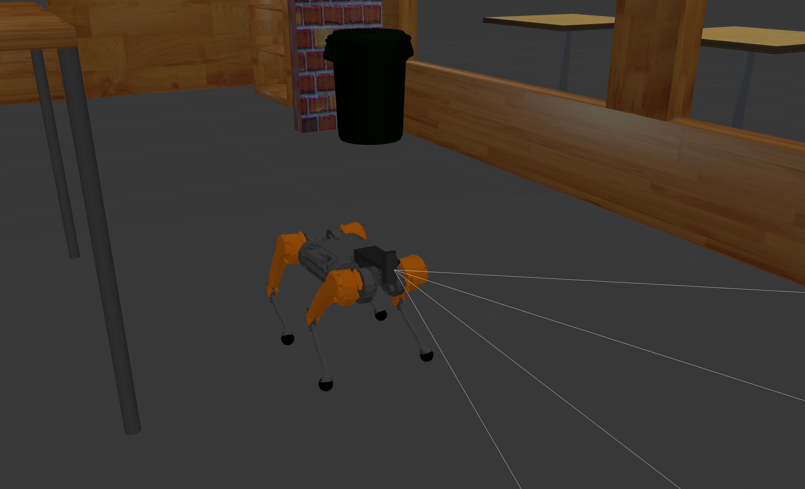

# QuadStack
Software stack MAB and Unitree Quadrupeds

<div style="display: flex; justify-content: space-between;">
    
    
    
    
    
</div>

# Install
To clone

```bash
git clone https://github.com/dyumanaditya/quad-stack --recursive
```

# Setup
To install all the necessary dependencies run the following

```bash
chmod +x setup.sh
./setup.sh
```

# Usage

Here are the commands to run the package. The following launch arguments are supported

- `robot` (silver_badger, honey_badger, a1, go1, go2)
- `world` (the name of any world file in the [gazebo worlds folder](./quad_stack/quadstack_gazebo/worlds/))
- `x_pose`, `y_pose`, `z_pose`
- `map` (absolute path of a map yaml file) if you are running navigation and want to use a pre-made map


### Spawning the robot

```bash
ros2 launch quadstack_bringup spawn_robot.launch.py world:=empty_world.world robot:=a1
```

### Teleoperating the robot

```bash
ros2 launch quadstack_bringup teleop.launch.py world:=empty_world.world robot:=a1
```

### Visual and Legged Odometry

```bash
ros2 launch quadstack_bringup odometry.launch.py robot:=silver_badger
```

### Navigation Stack
**Note:** Replace the map path by your absolute path, this is just an example
```bash
ros2 launch quadstack_bringup navigation.launch.py map:=/home/ws/src/quad-stack/quad_stack/quadstack_localization/maps/turtlebot_map.yaml robot:=a1
```